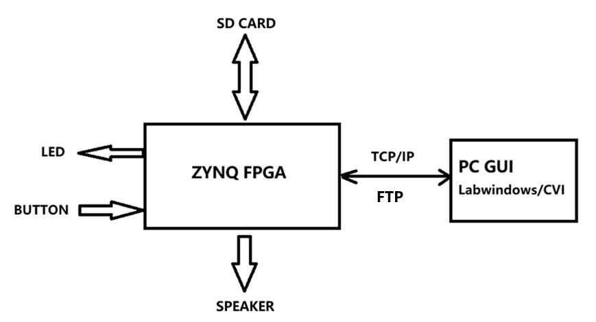
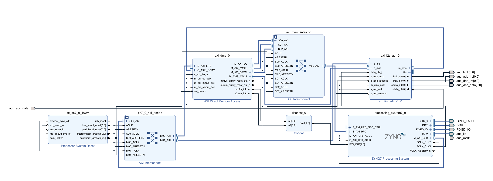
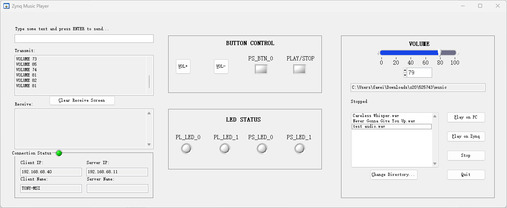

# Zynq Network-Controlled Audio Player

This project implements a network-controlled audio player using a Xilinx Zynq FPGA board and a LabWindows/CVI PC application.

The system allows a user to transfer `.wav` audio files from a PC to the Zynq board and control playback remotely over Ethernet. The Zynq Processing System handles real-time audio playback using DMA and an I2S audio interface, while the PC application provides a graphical user interface (GUI) for control and file transfer.

---

## Hardware Platform
- Board: 正点原子 领航者 Navigator Zynq-7020
- SoC: Xilinx Zynq-7000 (ARM Cortex-A9 + FPGA)
- Audio Codec: WM8960 (via [AXI I2S ADI IP](https://github.com/analogdevicesinc/hdl/tree/main/library/axi_i2s_adi))
- Network Interface: Ethernet

---

## Features
- TCP/IP communication using lwIP for remote control
- FTP-based file transfer from PC to Zynq
- WAV audio playback using AXI DMA and I2S interface
- LabWindows/CVI GUI for play, stop, and volume control

---

## Technologies Used
- Xilinx Vivado 2023.1.0 (hardware design)
- Xilinx Vitis 2023.1.0 (embedded software)
- lwIP TCP/IP stack
- LabWindows/CVI (PC GUI application)

---

## Folder Structure
- `FPGA/` – Vivado hardware design and Vitis embedded software project  
- `CVI/` – LabWindows/CVI PC application source code  
- `music/` – Sample `.wav` audio files for transfer and playback  

---

## System Overview
- PC (LabWindows/CVI) sends control commands and transfer audio files via FTP 
- Zynq FPGA receives files and performs real-time audio playback  
- Audio output through on-board audio codec and speaker using I2S 

---

## Functional Block Diagram

### Functional Block Diagram Description
The Zynq FPGA is the central processing unit. It receives inputs from physical buttons and controls LED and Button. 

PC application sends control commands using TCP/IP and transfer audio files via FTP.

Then, the FPGA receives files and save to SD Card then playing music on the speaker.

---

## Hardware Block Design

### Hardware Block Design Description
The hardware design is centered around the Zynq Processing System (PS), which controls the overall system and runs the embedded software.

- The **AXI DMA** transfers audio data from system memory to the audio interface.
- The **AXI I2S (ADI) IP core** converts AXI stream data into I2S format for audio output.
- The **WM8960 audio codec** receives the I2S signal and drives the speaker or headphones.
- AXI interconnects are used to connect the processing system with the DMA and peripheral IP cores.
- Clocking and reset logic ensure proper synchronization across all components.

The processor also integrates lwIP networking to receive control commands and audio files from the PC over Ethernet. This architecture enables efficient, real-time audio playback by offloading data transfer to the DMA while the processor handles control and networking tasks.

---

## PC Manual Panel GUI

### PC Manual Panel GUI Description
The manual panel provides a PC interface for communicating with the FPGA over ethernet. On the left, TCP connection status allows connection management and status monitoring, which is useful for debugging and optional command control. The LED control section allows the user to remotely turn LEDs on and off through commands sent to the FPGA board. The button status panel displays the real-time state of physical buttons on the Zynq board, allowing verification of GPIO inputs. On the Right, we can adjust the volume bar to adjust music volume, we can also click on the “Change Directory” button to change different music folder to play different .wav audio music. Overall, this manual panel enables real-time control and testing of the embedded system from the PC.

---

## How to Run

### 1. FPGA Hardware (Vivado)
1. Go to `FPGA/Zynq_musicPlayer_FPGA`  
2. Open `Zynq_musicPlayer_FPGA.xpr` in Vivado  
3. Generate the bitstream  
4. Export the hardware (XSA file)  

---

### 2. Embedded Software (Vitis)
1. Open Vitis and import the hardware platform (`.xsa`)  
2. Import the application project from `FPGA/Zynq_musicPlayer_FPGA/vitis`  
3. Build the project  
4. Program the Zynq board and run the application  

---

### 3. PC Application (LabWindows/CVI)
1. Open the project in `CVI/Zynq_musicPlayer_cvi`  
2. Build and run the GUI application  
3. Enter the Zynq board IP address  
4. Use the GUI to:
   - Transfer `.wav` files (via FTP)  
   - Control playback (Play / Stop)  
   - Adjust volume  

---

### 4. Audio Playback
- Connect a speaker or headphones to the Zynq board  
- Transfer a `.wav` file from the PC  
- Use the GUI to start playback  

---